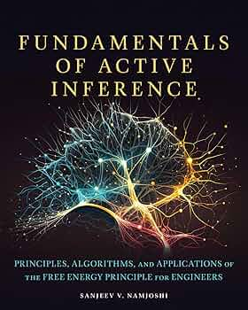

# Active Inference Institute — Organizational Website

[](https://activeinferenceinstitute.github.io/aii-org/)
[(3)%20Nonprofit-green)](https://www.activeinference.institute)

The **Active Inference Institute** is a volunteer-led **501(c)(3) nonprofit** dedicated to improving the accessibility, rigor, and applicability of the **Free Energy Principle** and **Active Inference** through open-science principles. Founded in 2021 and co-founded by **Daniel Friedman**, the Institute supports a global community of researchers, students, engineers, and enthusiasts across education, research, and tool development.

This repository contains the Institute's public-facing organizational website, built as a static GitHub Pages site with no build step or bundler. The standalone simulations are self-contained HTML files, and a few load Google Fonts for typography.

---

## About Active Inference

**Active Inference** is a unified framework for modelling perception, cognition, and action in biological and artificial systems. Building on Karl Friston's **Free Energy Principle** — the idea that adaptive systems minimize surprise (or "free energy") through predictive processing and action — Active Inference provides a principled, interpretable approach to understanding intelligent behaviour at all scales.

---

## Key Resources

| Resource | Link |
|----------|------|
| **Website** | [activeinference.institute](https://www.activeinference.institute) |
| **YouTube** | [youtube.com/c/ActiveInference](https://www.youtube.com/c/ActiveInference) |
| **Discord** | [discord.com/invite/FSUvYD2p9S](https://discord.com/invite/FSUvYD2p9S) |
| **GitHub** | [github.com/ActiveInferenceInstitute](https://github.com/ActiveInferenceInstitute) |
| **Symposium** | [symposium.activeinference.institute](https://symposium.activeinference.institute/) |
| **Email** | blanket@activeinference.institute |

### Textbooks

- **[Active Inference: The Free Energy Principle in Mind, Brain, and Behavior](https://mitpress.mit.edu/9780262045353/active-inference/)** — Thomas Parr, Giovanni Pezzulo & Karl Friston (MIT Press, 2022). The foundational textbook; the Institute hosts ongoing [Textbook Group](https://textbook-group.activeinference.institute/) cohorts (now in Cohort 7).
- **[Fundamentals of Active Inference: Principles, Algorithms, and Applications of the Free Energy Principle for Engineers](https://mitpress.mit.edu/9780262050951/fundamentals-of-active-inference/)** — Sanjeev V. Namjoshi (MIT Press, 2025 · ISBN 9780262050951). An engineering-focused companion developed in collaboration with the Institute since 2023, endorsed by Karl Friston. The 12 interactive simulations in this repository accompany this textbook.

<p align="center">
  
</p>

### Applied Active Inference Symposium Series

| Year | Edition | Theme | Link |
|------|---------|-------|------|
| 2021 | 1st | — | [Zenodo Record](https://zenodo.org/records/5797072) |
| 2022 | 2nd | Robotics | [Coda Page](https://coda.io/@active-inference-institute/2nd-applied-active-inference-symposium) |
| 2023 | 3rd | Enacting Ecosystems of Shared Intelligence | [Coda Page](https://coda.io/@active-inference-institute/3rd-applied-active-inference-symposium) |
| 2024 | 4th | — | [Program](https://coda.io/d/Applied-Active-Inference-Symposium-2024_dQa03zJJkvJ/Symposium-Program_surazvwP#Session-timestamps_tuN06EQq) |
| 2025 | 5th | Industry | [Program](https://coda.io/d/Applied-Active-Inference-Symposium-2025_d08cdDbWwRy/Symposium-Program_surazvwP#_luf3ZkIk) |

---

## Directory Structure & Architecture

This repository uses a modular folder structure to enforce clean boundaries between core site pages and standalone applications.

```
aii-org/
├── index.html                      ← Home page (entry point)
├── site.css                        ← Shared design tokens
├── site-components.js              ← Shared navigation, header, footer logic
├── pages/                          ← Core static site pages
│   ├── history.html                ← History timeline
│   ├── vision-mission.html         ← Strategy & Goals
│   ├── bod.html                    ← Board of Directors
│   ├── sab.html                    ← Scientific Advisory Board
│   ├── simulations.html            ← Catalog index of demos
│   ├── research.html               ← Past, current & future projects
│   ├── education.html              ← Courses, textbook groups, internships
│   └── tools.html                  ← RxInfer.jl & open-source code
├── simulations/                    ← 12 standalone Canvas interactive demos
│   ├── Ink.html                    ← 100% independent HTML/JS applications
│   ├── Apple-Frog.html
│   ├── fep_surprise.html
│   ├── ...
├── assets/                         ← Static payload (images, PDF)
│   ├── bod/                        ← BOD headshots
│   └── sab/                        ← SAB headshots
├── README.md                       ← This file
└── AGENTS.md                       ← Agentic context & conventions
```

### Technical Notes

- **No build system or bundler.** Pure HTML, CSS, and vanilla JavaScript.
- **No external dependencies.** No CDN, npm, or JS libraries.
- `site.css` → Design tokens, typography, header/footer styles.
- `site-components.js` → Injects navigation, canvas logos, mega-menu; handles UK spelling localisation dynamically across depths (`basePath`).
- All `simulations/` are **standalone webapps** — inline styles and logic, rendering via the Canvas API with zero shared dependencies.

---

## Interactive Simulations

12 companion demos for the foundational textbooks, covering concepts from Bayesian inference to hierarchical Markov blankets. Each is a self-contained HTML file with no dependencies. See [`simulations/README.md`](simulations/README.md) for a complete conceptual breakdown by difficulty level.

---

## Contributing

This site is maintained by the Active Inference Institute. Contributions, corrections, and ideas for new simulations are welcome.

1. Fork the repository
2. Create a feature branch
3. For site pages, edit `pages/` (these use `site.css` + `site-components.js`)
4. For demos, edit `simulations/` (these are self-contained)
5. Open a pull request

### Adding a New Site Page

1. Create an HTML file in `pages/`
2. Include `<link rel="stylesheet" href="../site.css">` in the `<head>`
3. Add `<div id="site-header"></div>` before content and `<div id="site-footer"></div>` after
4. Include `<script src="../site-components.js"></script>` before `</body>`

### Local Development

No build step is required. Serve the repository root with any static HTTP server:

```bash
python3 -m http.server 8000
```

Then open [http://localhost:8000](http://localhost:8000) in your browser. All navigation, asset paths, and `basePath` logic work correctly under this setup.

### Deployment

Push to `main` branch — GitHub Pages deploys automatically. No build step required, and the published site resolves to `https://www.activeinference.institute/`.

---

## License

© 2026 The Active Inference Institute. All rights reserved.
